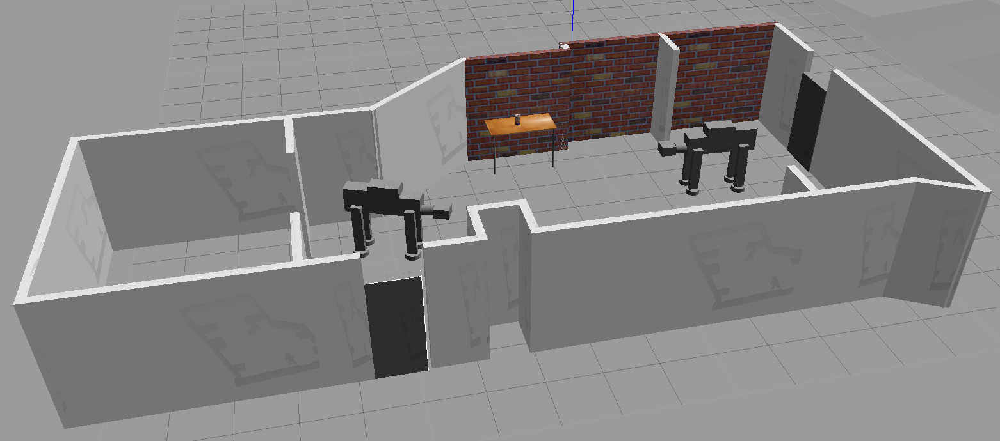

# RoboProj1
Loads a Gazebo world file containing two Imperial ATAT Walker models, and demonstrates the use of a simple C++ plugin that prints "Welcome to Joe's World!" to the command line when Gazebo starts up.

# Installation

Step 1: Install Gazebo
Follow the instructions for your environment at http://gazebosim.org/tutorials?cat=install

Ubuntu one line installation:
```bash
$ curl -sSL http://get.gazebosim.org | sh
```

Step 2:
Clone the repository into your workspace
```bash
$ git clone https://www.github.com/joestilin/RoboProj1
```

Step 3:
Create a build directory and compile the code
```bash
$ cd /RoboProj1
$ mkdir build
$ cd build/
$ cmake ../
$ make
$ export GAZEBO_PLUGIN_PATH=${GAZEBO_PLUGIN_PATH}:~/RoboProj1/build
```
# Usage
```bash
$ cd /RoboProj1/world
$ gazebo apartmentworld
```
And there are your ATAT Walkers in a New York Apartment!

